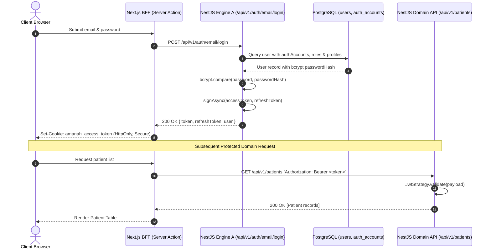
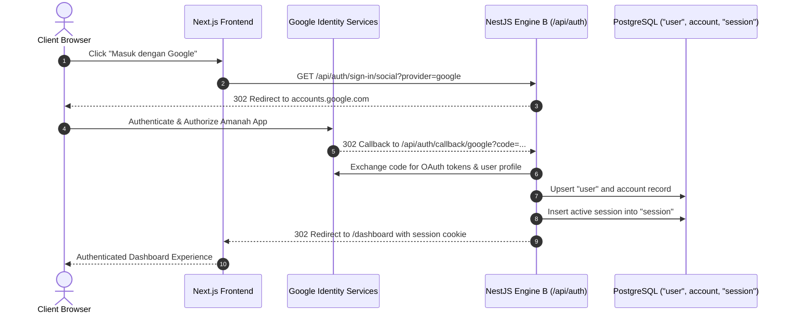

# Authentication Architecture Documentation

> **Document Type:** Normative Architecture Reference  
> **Target Subsystem:** Authentication, Identity & Access Management (IAM)  
> **Repository Scope:** Upstream NestJS Backend (`D:\Amanah-backend`) & Next.js Consumer (`D:\kolaborasihealthcare`)  
> **Last Updated:** September 19, 2026  

---

## 1. Architectural Overview & System Topography

The Amanah Healthcare authentication architecture operates as a **dual-engine hybrid authentication gateway**. It simultaneously supports stateless cryptographic JSON Web Tokens (JWT) for microservice-style domain API consumption and stateful session cookies for full-stack web interactions.

```
                                  +-------------------------------------------------------+
                                  |                 Next.js Frontend (BFF)                |
                                  |         (Proxy, RSC Loaders, Server Actions)          |
                                  +-------------------------------------------------------+
                                                 /                         \
                          Cookie / Bearer Token /                           \ Session Cookie
                                               v                             v
           +---------------------------------------------+   +-----------------------------------------+
           |     Engine A: Kanonikal JWT (Passport)      |   |        Engine B: Better Auth Gateway    |
           |             Path: /api/v1/auth/*            |   |               Path: /api/auth/*         |
           +---------------------------------------------+   +-----------------------------------------+
           | - Controller: AuthController (v1)           |   | - Controller: BetterAuthController      |
           | - Service: AuthService                      |   | - Engine: toNodeHandler(auth)           |
           | - Strategies: JwtStrategy, JwtRefresh       |   | - Plugins: admin, bearer                |
           | - Guards: AuthGuard('jwt'), RolesGuard      |   | - Guards: BetterAuthGuard, RbacGuard    |
           +---------------------------------------------+   +-----------------------------------------+
                                  |                                               |
                     Drizzle ORM Relational Queries                       Raw PostgreSQL Pool (pg)
                                  |                                               |
                                  v                                               v
           +---------------------------------------------+   +-----------------------------------------+
           |         Canonical Relational Schema         |   |            Better Auth Schema           |
           | ------------------------------------------- |   | --------------------------------------- |
           | - users (Core User Identity)                |   | - user (Better Auth User Profile)       |
           | - auth_accounts (Credential/OAuth hashes)   |   | - account (OAuth Provider / Credentials)|
           | - user_roles & roles (RBAC system)          |   | - session (Active user sessions)        |
           | - staff_profiles & patient_profiles         |   | - verification (Tokens & hashes)        |
           +---------------------------------------------+   +-----------------------------------------+
```

---

## 2. Dual Engine Architecture

### 2.1 Engine A: Kanonikal JWT (Passport)
- **Base Route**: `/api/v1/auth`
- **Specification**: OpenAPI 3.0 / Swagger documented under tag `Auth (Kanonikal JWT)`
- **Core Controller**: `src/auth/auth.controller.ts`
- **Core Service**: `src/auth/auth.service.ts`
- **Strategy Implementations**:
  - `JwtStrategy` (`src/auth/strategies/jwt.strategy.ts`): Validates incoming `Authorization: Bearer <token>`, extracts claims, and verifies existence against the `users` table via Drizzle ORM.
  - `JwtRefreshStrategy` (`src/auth/strategies/jwt-refresh.strategy.ts`): Validates incoming refresh token signed by `auth.refreshSecret`.
- **Purpose**: Authorizes all 34 internal domain controllers across the clinical ecosystem (`/api/v1/patients`, `/api/v1/appointments`, `/api/v1/medical-records`, `/api/v1/schedules`, `/api/v1/attendance`, etc.).

### 2.2 Engine B: Better Auth Gateway
- **Base Route**: `/api/auth`
- **Specification**: Excluded from OpenAPI Swagger (`@ApiExcludeController()`).
- **Core Controller**: `src/auth/better-auth/better-auth.controller.ts`
- **Engine Core**: `src/auth/better-auth/auth.ts` powered by `better-auth` v1.x.
- **Plugins**:
  - `adminPlugin`: Manages roles (`admin`, `staffDoctor`, `staffMidwife`, `staffWorker`, `patient`), impersonation, and banned user enforcement.
  - `bearer`: Allows passing session token via `Authorization: Bearer <session-token>`.
- **Purpose**: Provides turnkey web sessions, Google OAuth social login workflows, rate-limited public credential verification, and administrative user management.

---

## 3. Data Flow & Request Lifecycles

### 3.1 Credential Login & Domain API Call (Engine A)



### 3.2 Social OAuth Flow with Google (Engine B)



---

## 4. Database Topography & Schema Duality

### 4.1 Schema Mapping Matrix

| Domain Property | Canonical Schema (Engine A) | Better Auth Schema (Engine B) | Synchronization Mechanism |
| :--- | :--- | :--- | :--- |
| **User Identity** | `users (id: uuid, email, name, status)` | `"user" (id: uuid, email, name, role)` | Matched during dev seeding (`seed.ts#L208-L268`). |
| **Credentials** | `auth_accounts (provider_id, password_hash)` | `account (providerId, password)` | Matched during dev seeding (`seed.ts#L234-L304`). |
| **Role Definition**| `roles (code, name)` & `user_roles (user_id, role_id)` | `"user".role (text)` | `mapRoleCodeToBetterAuthRole()` during seeding. |
| **Session State** | Stateless JWT (No DB row) | `"session" (id, token, userId, expiresAt)` | Distinct. Session table created by Better Auth. |
| **Verification** | Stateless JWT Hash | `verification (identifier, value, expiresAt)` | Distinct. |

---

## 5. Security Model

### 5.1 Cryptography & Hashing
- **Password Hashes**: Salted bcrypt (`bcrypt.hash(password, 10)`), shared between both engines.
- **Token Signing**: HMAC-SHA256 (`HS256`).
  - Access Token: Signed with `auth.secret` (`JWT_SECRET`).
  - Refresh Token: Signed with `auth.refreshSecret` (`JWT_REFRESH_SECRET`).
  - Forgot Password Token: Signed with `auth.forgotSecret` (`JWT_FORGOT_SECRET`).

### 5.2 Cookie Security Architecture
- **`HttpOnly`**: Enabled on all auth cookies, preventing XSS-based token extraction.
- **`SameSite`**: Configured to `Lax`, mitigating Cross-Site Request Forgery (CSRF).
- **`Secure`**: Enforced when `NODE_ENV === 'production'`.

### 5.3 Network & Sink Isolation
- **SMTP Isolation**: All outbound emails are routed through the local Mailpit container (`http://localhost:8025` / SMTP `1025`). Zero outbound emails leak to third-party services in non-production environments.

---

## 6. Guard Pipeline & Middleware Chain

### 6.1 Execution Order for Protected Domain Requests
```
Incoming HTTP Request
       │
       ▼
┌───────────────────────────────────────┐
│ Global Request Logging Middleware     │
└──────────────────┬────────────────────┘
                   │
                   ▼
┌───────────────────────────────────────┐
│ AuthGuard('jwt') (Passport)           │
│ - Checks Authorization: Bearer header │
│ - Decodes & verifies HS256 signature  │
│ - Hydrates req.user from users table  │
└──────────────────┬────────────────────┘
                   │
                   ▼
┌───────────────────────────────────────┐
│ RolesGuard (Reflector)                │
│ - Inspects @Roles() metadata          │
│ - Evaluates req.user.systemRole       │
│ - Throws 403 Forbidden if mismatched  │
└──────────────────┬────────────────────┘
                   │
                   ▼
┌───────────────────────────────────────┐
│ Target Domain Controller Handler      │
└───────────────────────────────────────┘
```

---

## 7. Frontend Integration Strategy

1. **BFF Client Routing**: The Next.js client routes primary authentication to `loginAction` (`src/server/actions/auth.actions.ts`), establishing session cookies for Engine A (`amanah_access_token`).
2. **Dual-Session Sync**: To maintain synchronization across UI state, the login action invokes `signIn.email` on the Better Auth client.
3. **Session Hydration**: `loadCurrentUser()` in `src/server/loaders/auth.loader.ts` hydrates server components directly using `GET /api/v1/auth/me`.
