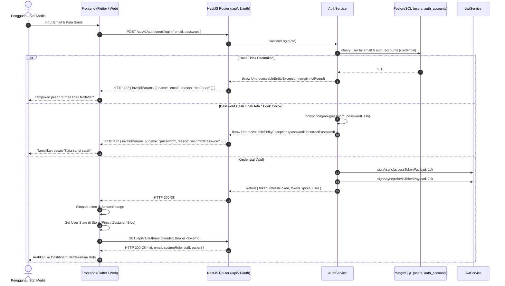
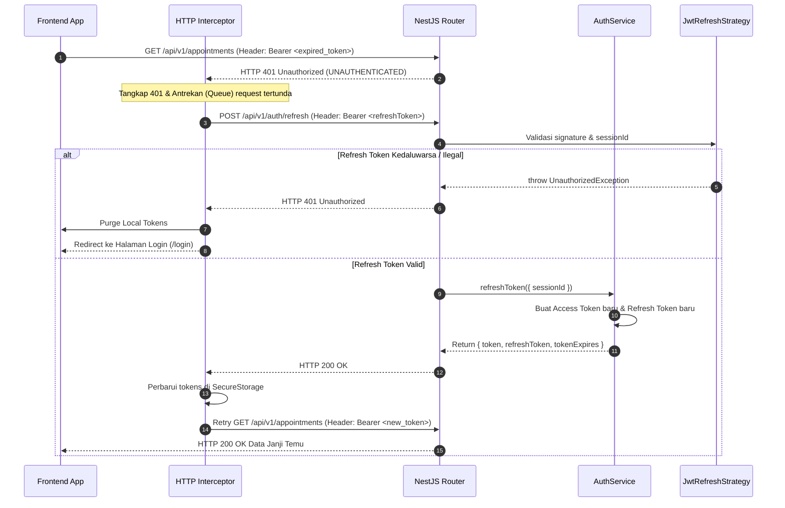
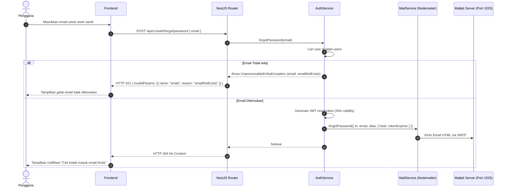

# Diagram Alir & Siklus Autentikasi: Modul Authentication

> **Standard:** Mermaid Diagrams (Sequence & Flowchart)  
> **Source Evidence:** [`src/auth/auth.controller.ts`](file:///D:/Amanah-backend/src/auth/auth.controller.ts), [`src/auth/auth.service.ts`](file:///D:/Amanah-backend/src/auth/auth.service.ts), [`src/auth/better-auth/auth.ts`](file:///D:/Amanah-backend/src/auth/better-auth/auth.ts)  

---

## 1. Alur Login Kredensial & Inisialisasi Profil (Engine A: JWT)

Diagram ini mengilustrasikan alur dari pengguna memasukkan kredensial pada frontend hingga token disimpan dan profil pengguna (beserta data dokter/pasien) berhasil dimuat ke state aplikasi:



---

## 2. Alur Silent Token Refresh (Auto-Rotation)

Diagram ini mengilustrasikan penanganan refresh token otomatis menggunakan Axios/Fetch interceptor ketika access token kedaluwarsa:



---

## 3. Alur Pemulihan Kata Sandi (Forgot Password via SMTP/Mailpit)

Diagram ini mengilustrasikan alur pemulihan kata sandi yang telah terintegrasi dengan Mailer/Mailpit:



---

## 4. Alur Sesi Better Auth (Web Admin / Backoffice)

Diagram ini mengilustrasikan autentikasi berbasis sesi stateful yang tersimpan di tabel database `"session"`:

```mermaid
sequenceDiagram
    autonumber
    actor Admin as Admin Backoffice
    participant Browser as Web Browser (SPA)
    participant BetterAuth as BetterAuthController (/api/auth/*)
    participant DB as PostgreSQL ("session", "user")

    Admin->>Browser: Masuk dengan Email & Password
    Browser->>BetterAuth: POST /api/auth/sign-in/email { email, password }
    BetterAuth->>DB: Validasi kredensial & Insert record ke tabel "session"
    BetterAuth-->>Browser: HTTP 200 OK (Set-Cookie: better-auth.session_token; HttpOnly; SameSite=Lax)
    Note over Browser: Browser menyimpan cookie aman secara otomatis
    Browser->>BetterAuth: GET /api/auth/get-session (Otomatis menyertakan Cookie)
    BetterAuth->>DB: Query tabel "session" & join "user"
    BetterAuth-->>Browser: HTTP 200 OK { session, user: { role: "admin" } }
    Browser-->>Admin: Buka Halaman Manajemen Staf & User
```

---

## 5. Komparasi Alur Logout

```mermaid
flowchart TD
    subgraph Engine_A [Engine A: Kanonikal JWT]
        A1[User Klik Tombol Logout] --> A2[Client Panggil POST /api/v1/auth/logout]
        A2 --> A3[Server Return HTTP 204 No-Op]
        A3 --> A4[Client Wajib Hapus Token dari LocalStorage / SecureStorage]
        A4 --> A5[Selesai - Sesi Sisi Klien Berakhir]
    end

    subgraph Engine_B [Engine B: Better Auth]
        B1[User Klik Tombol Logout] --> B2[Client Panggil POST /api/auth/sign-out]
        B2 --> B3[Better Auth Menghapus Baris dari Tabel session di DB]
        B3 --> B4[Server Bersihkan Cookie & Return HTTP 200]
        B4 --> B5[Selesai - Sesi Sisi Server Terhapus Permanen]
    end
```


