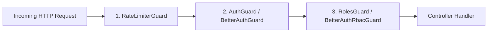

# Role-Based Access Control (RBAC): Modul Authentication

> **Standard:** Dual-Model RBAC (Kanonikal System Role & Fine-Grained Better Auth Permissions)  
> **Source Evidence:** [`src/common/auth/roles.guard.ts`](file:///D:/Amanah-backend/src/common/auth/roles.guard.ts), [`src/auth/better-auth/permissions.ts`](file:///D:/Amanah-backend/src/auth/better-auth/permissions.ts), [`src/auth/better-auth/guards/better-auth-rbac.guard.ts`](file:///D:/Amanah-backend/src/auth/better-auth/guards/better-auth-rbac.guard.ts)  

---

## 1. Arsitektur Dual-Model RBAC

Backend Amanah Healthcare mengoperasikan dua model kontrol akses yang saling melengkapi:

```text
                  ┌────────────────────────────────────────────────────────┐
                  │                 Pengguna Terotentikasi                 │
                  └───────────────────────────┬────────────────────────────┘
                                              │
                    ┌─────────────────────────┴─────────────────────────┐
                    ▼                                                   ▼
       [Model 1: Core SystemRole]                           [Model 2: Better Auth RBAC]
         Enum: ADMIN, STAF, PATIENT                          5 Roles Klinis & Fine-Grained
         Digunakan: Kanonikal REST API                        Digunakan: Backoffice & Admin Guard
```

### Model 1: Core SystemRole (Kanonikal JWT)
Model ini tertanam pada JWT Access Token untuk otorisasi cepat pada level controller:
* **Tiga Nilai Role Utama:**
  1. `ADMIN`: Administrator sistem klinik dengan hak akses tak terbatas.
  2. `STAF`: Tenaga medis dan operasional klinik (Dokter, Bidan, Perawat, Staf Pendaftaran).
  3. `PATIENT`: Pengguna publik / pasien klinik.
* **Logika Resolusi Role (`auth.service.ts` & `jwt.strategy.ts`):**
  ```typescript
  // Resolusi otomatis berdasarkan profil database:
  if (primaryRole?.code === 'admin') {
    systemRole = 'ADMIN';
  } else if (
    primaryRole?.code === 'staff_doctor' ||
    primaryRole?.code === 'staff_midwife' ||
    primaryRole?.code === 'staff_worker' ||
    (user.staffProfiles && user.staffProfiles.length > 0)
  ) {
    systemRole = 'STAF';
  } else {
    systemRole = 'PATIENT';
  }
  ```

### Model 2: Better Auth RBAC (Granular Medical Permissions)
Model ini mendefinisikan 5 peran klinis spesifik dengan izin per-resource:
1. `admin`: Administrator Sistem
2. `staffDoctor`: Dokter Spesialis / Dokter Umum
3. `staffMidwife`: Bidan & Tenaga Kebidanan
4. `staffWorker`: Tenaga Administrasi & Staf Penunjang
5. `patient`: Pasien / Pasien Rawat Jalan

---

## 2. Matriks Hak Akses Granular (Better Auth Permissions)

Tabel berikut adalah matriks izin yang dieksekusi secara ketat oleh [`src/auth/better-auth/permissions.ts`](file:///D:/Amanah-backend/src/auth/better-auth/permissions.ts#L8-L73):

| Resource | Action | `admin` | `staffDoctor` | `staffMidwife` | `staffWorker` | `patient` |
| :--- | :--- | :---: | :---: | :---: | :---: | :---: |
| **`clinic`** | `create`, `update`, `delete` | ✅ | ❌ | ❌ | ❌ | ❌ |
| | `read` | ✅ | ✅ | ✅ | ✅ | ✅ |
| **`patient`** | `create`, `delete` | ✅ | ❌ | ❌ | ❌ | ❌ |
| | `read` | ✅ | ✅ | ✅ | ❌ | ✅ *(Milik sendiri)* |
| | `update` | ✅ | ❌ | ❌ | ❌ | ✅ *(Milik sendiri)* |
| **`staff`** | `create`, `update`, `delete` | ✅ | ❌ | ❌ | ❌ | ❌ |
| | `read` | ✅ | ✅ | ✅ | ✅ | ❌ |
| **`schedule`** | `create`, `update` | ✅ | ✅ | ✅ | ❌ | ❌ |
| | `read` | ✅ | ✅ | ✅ | ❌ | ❌ |
| | `delete` | ✅ | ❌ | ❌ | ❌ | ❌ |
| **`appointment`**| `create` | ✅ | ❌ | ❌ | ❌ | ✅ |
| | `read` | ✅ | ✅ | ✅ | ❌ | ✅ *(Milik sendiri)* |
| | `call` (Panggil antrean) | ✅ | ✅ | ✅ | ❌ | ❌ |
| | `complete` (Selesaikan) | ✅ | ✅ | ✅ | ❌ | ❌ |
| | `update`, `delete` | ✅ | ❌ | ❌ | ❌ | ❌ |
| **`medicalRecord`**| `create`, `update` | ✅ | ✅ | ✅ | ❌ | ❌ |
| | `read` | ✅ | ✅ | ✅ | ❌ | ✅ *(Milik sendiri)* |
| **`attendance`** | `record`, `read` | ✅ | ✅ | ✅ | ✅ | ❌ |
| | `export` | ✅ | ❌ | ❌ | ❌ | ❌ |
| **`leave`** | `create`, `read` | ✅ | ✅ | ✅ | ✅ | ❌ |
| | `approve`, `update` | ✅ | ❌ | ❌ | ❌ | ❌ |

---

## 3. Eksekusi Guard & Urutan Evaluasi Pipeline

Setiap permintaan ke backend melewati pipa proteksi (Pipeline Guards) dengan urutan deterministik:



1. **`RateLimiterGuard`**: Memeriksa batasan kuota request di Redis. Jika terlewati, melempar HTTP `429 Too Many Requests`.
2. **`AuthGuard('jwt')` / `BetterAuthGuard`**: Memverifikasi token kriptografis. Jika tidak sah/kedaluwarsa, melempar HTTP `401 Unauthorized`.
3. **`RolesGuard` / `BetterAuthRbacGuard`**: Memeriksa metadata peran (`@Roles('ADMIN')` atau `@RequirePermission('medicalRecord', 'update')`). Jika pengguna tidak memenuhi kriteria, melempar HTTP `403 Forbidden`.

---

## 4. Panduan Frontend: Conditional UI Rendering

Frontend disarankan membuat utility helper terpusat untuk menampilkan atau menyembunyikan tombol aksi pada antarmuka berdasarkan role pengguna:

```typescript
// Contoh TypeScript Helper untuk Frontend (Web/Mobile):
export type SystemRole = 'ADMIN' | 'STAF' | 'PATIENT';
export type BetterAuthRole = 'admin' | 'staffDoctor' | 'staffMidwife' | 'staffWorker' | 'patient';

export function canAccessClinicalNotes(user: { systemRole?: SystemRole; role?: string }): boolean {
  // Hanya staf medis dokter dan bidan atau admin yang dapat mengedit rekam medis
  return (
    user.systemRole === 'ADMIN' ||
    user.role === 'admin' ||
    user.role === 'staffDoctor' ||
    user.role === 'staffMidwife'
  );
}

export function canCallQueue(user: { role?: string }): boolean {
  return ['admin', 'staffDoctor', 'staffMidwife'].includes(user.role || '');
}
```
